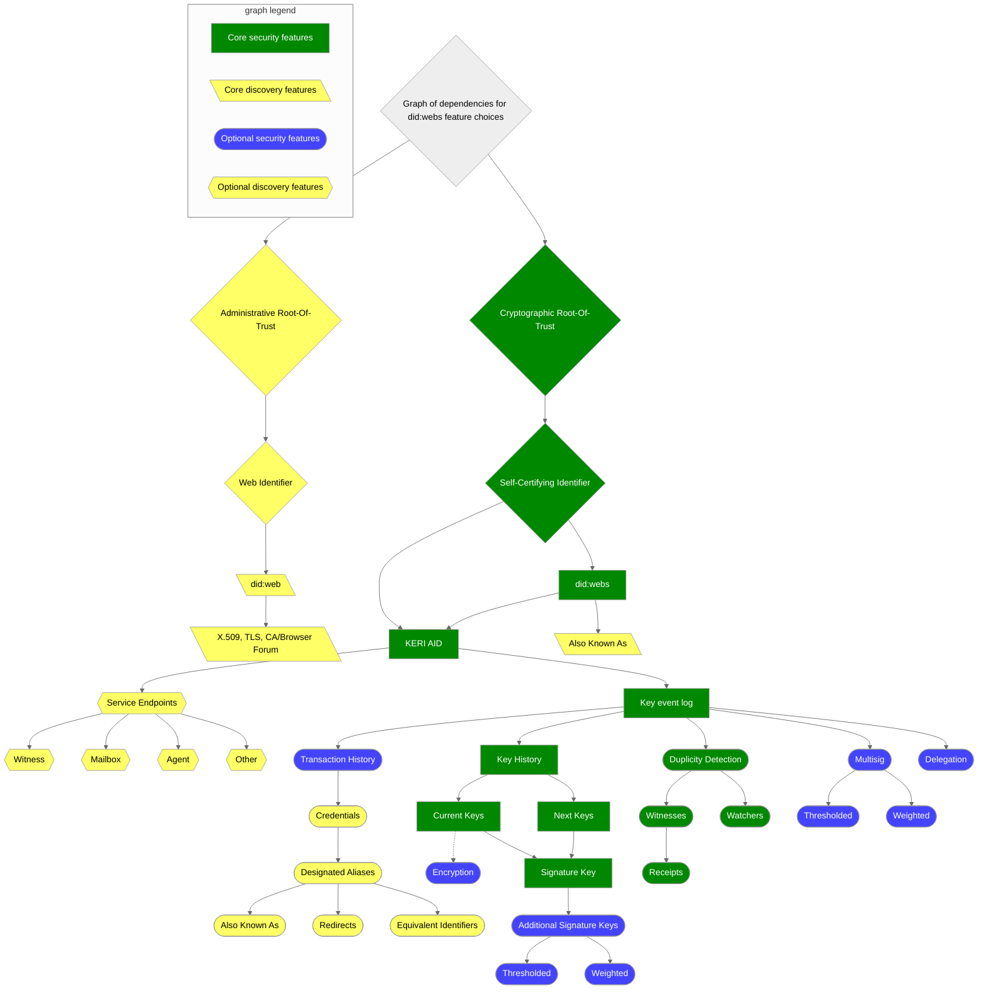

Here we detail the decision tree of the security related features that `did:webs` users should consider to determine what features they need to build their secure identity with `did:webs`:

```mermaid
%%{init: {'theme':'neutral'}}%%
graph
    %% legend
    subgraph graph legend
    CORESEC[Core security features]:::core;
    COREDISC[\Core discovery features\]:::disc;
    OPSEC([Optional security features]):::opts;
    OPDISC{{Optional discovery features}}:::optd;
    end

    %% Tree root
    DTREE{Graph of dependencies for did:webs feature choices} --> AROT;
    DTREE --> CROT;
    
    %% did:web tree
    AROT{Administrative Root-Of-Trust}:::disc --> WID{Web Identifier};
    WID:::disc --> DIDWEB[\did:web\];
    DIDWEB:::disc --> X509[\X.509, TLS, CA/Browser Forum\]:::disc;
    
    %% did:webs tree
    CROT{Cryptographic Root-Of-Trust}:::core --> SCID{Self-Certifying Identifier};
    SCID:::core --> AID[KERI AID];
    SCID --> DIDWS[did:webs];
    DIDWS:::core --> AID;
    DIDWS --> AKA_DEF[\Also Known As\]:::disc;

    %% AID to KEL
    AID:::core --> KEL[Key event log];

    %% Service Endpoints
    AID --> END{{Service Endpoints}};
    END:::optd --> WIT_END{{Witness}}:::optd;
    END --> MAIL{{Mailbox}}:::optd;
    END --> AGENT{{Agent}}:::optd;  
    END --> ENDOTHER{{Other}}:::optd;

    %% Credentials - Designated aliases
    KEL --> THIST([Transaction History]);
    THIST:::opts --> CRED([Credentials]);
    CRED([Credentials]):::optd --> DALIAS([Designated Aliases]);
    DALIAS:::optd --> AKA([Also Known As]):::optd;
    DALIAS --> REDIRECT([Redirects]):::optd;
    DALIAS --> EQUIVID([Equivalent Identifiers]):::optd;

    %% Key History
    KEL:::core --> KHIST[Key History];
    K:::core -.-> ENCRYPT([Encryption]):::opts;
    KHIST:::core --> K[Current Keys];
    KHIST:::core --> nK[Next Keys]:::core;
    K:::core --> sK[Signature Key];    
    nK:::core --> sK;
    sK:::core --> mK([Additional Signature Keys]):::opts;
    mK --> sTHRESH([Thresholded]):::opts;
    mK --> sWEIGHT([Weighted]):::opts;
    
    %% receipts and 
    KEL --> BACK([Duplicity Detection]);
    BACK:::core --> WIT([Witnesses]):::core;
    WIT --> RECPT([Receipts]):::core;
    BACK --> WAT([Watchers]):::core;

    %% multisig
    KEL --> MSIG([Multisig]);
    MSIG:::opts --> MS_THRESH([Thresholded]):::opts;
    MSIG --> MS_WEIGHT([Weighted]):::opts;

    %% delegation
    KEL --> DEL([Delegation]):::opts;
    
    classDef core fill:#080,color:white;
    classDef disc fill:#FF6;
    classDef opts fill:#44F,color:white;
    classDef optd fill:#FF6;
```